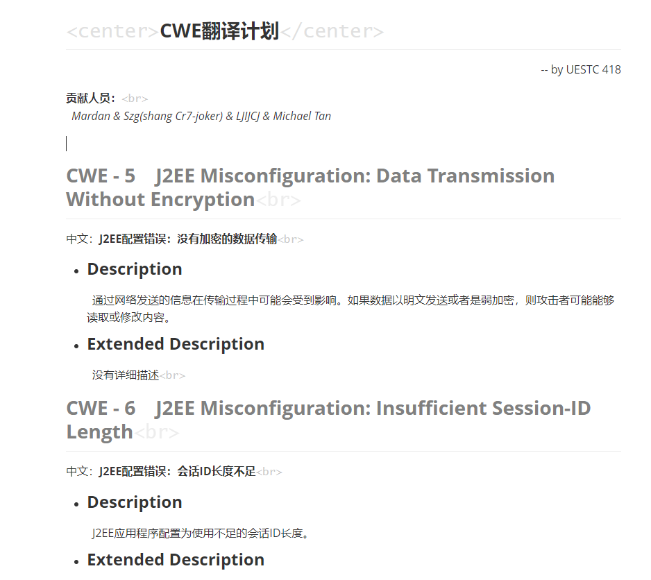

### 翻译CWE：常见弱点列举

cwe版本: 3.2
翻译效果:

[CWE™社区](http://cwe.mitre.org/index.html)



```python
def write_header():
    document = open('./document/CWE翻译计划.md','w')
    document.write("## <center>CWE翻译计划</center>")
    document.write('\n')
    document.write("<p align=\"right\">-- by UESTC 418</p>")
    document.write('\n')
    document.write("**贡献人员：**<br>")
    document.write('\n')
    document.write("&ensp;*Mardan & Szg(shang Cr7-joker) & LJIJCJ & Michael Tan*\n")
    document.write('\n\n\n')  
    document.close()

def document_format(ID, Previous_Entry_Name, Modification_Date, Name_zh, Name_en, Abstraction, Structure, Status, Description_zh, Description_en, Extended_Description_zh, Extended_Description_en):
    document = open('./document/CWE翻译计划.md','a')
    document.write("## <font color=gray>**CWE - " + ID + "\t" + Name_en + "**</font><br>")
    document.write('\n')
    document.write("中文：**" + Name_zh + "**<br>")
    document.write('\n')
    '''
    document.write('\n---')
    document.write('\n')
    document.write("**Weakness ID : **" + ID + "<br>")
    document.write('\n')
    document.write("**Structure : **" + Structure + "<br>")
    document.write('\n')
    document.write("**Abstraction : **" + Abstraction + "<br>")
    document.write('\n')
    document.write("**Status : **" + Status + "<br>")
    document.write('\n\n')
    document.write('---')
    document.write('\n\n')
    '''
    document.write("- ### Description")
    document.write('\n')
    #document.write(Description_en)
    #document.write('\n')
    document.write("&ensp;" + Description_zh)
    document.write('\n')
    document.write("- ### Extended Description")
    document.write('\n')
    #document.write(Extended_Description_en)
    #document.write('\n')
    document.write("&ensp;" + Extended_Description_zh)
    document.write('<br>\n\n')
```
